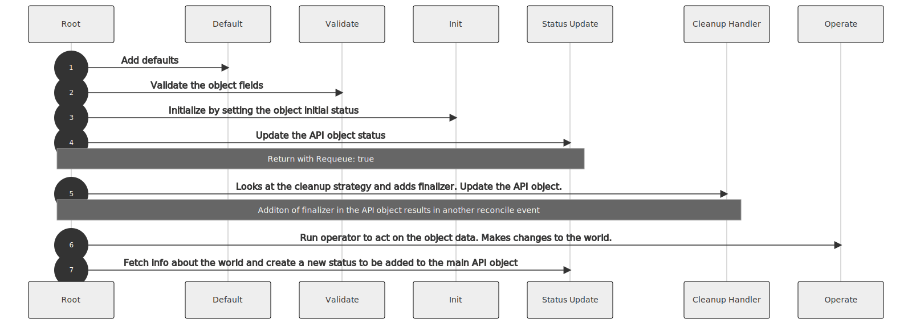
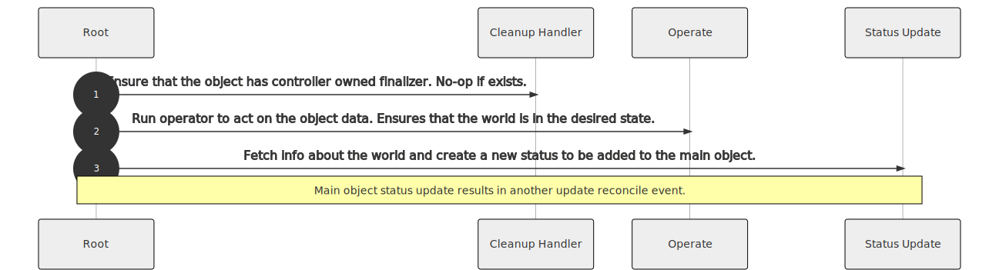
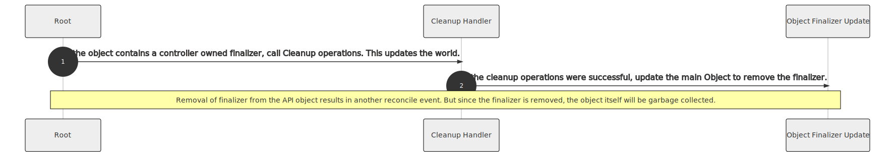

# Composite Controller

Composite controller pattern is used to implement controllers that have a
parent or main CRD, based on which the child objects are configured and
created. The status of the child objects may be reflected on the parent object
status. Changes in the parent object results in update of the child objects.

The lifecycle of the child objects are dependent on the parent object. The
dependency can be in the form of owner reference or finalizer.
In case of owner reference, the child objects have an owner reference metadata
with the parent's reference. When the parent is deleted, the child objects are
automatically deleted by the garbage collector.
In case of finalizer based dependency, the parent object waits for some custom
cleanup operations to complete. Once the cleanup operation is completed
successfully, the finalizer on the parent object is removed and the parent is
deleted.

## Finalizer based cleanup strategy

The finalizer based cleanup strategy is relatively complex compared to the
owner reference based cleanup. Following diagrams try to explain the sequence
of the actions when finalizer based cleanup is used.

### Create reconcile

### Update reconcile

### Delete reconcile

